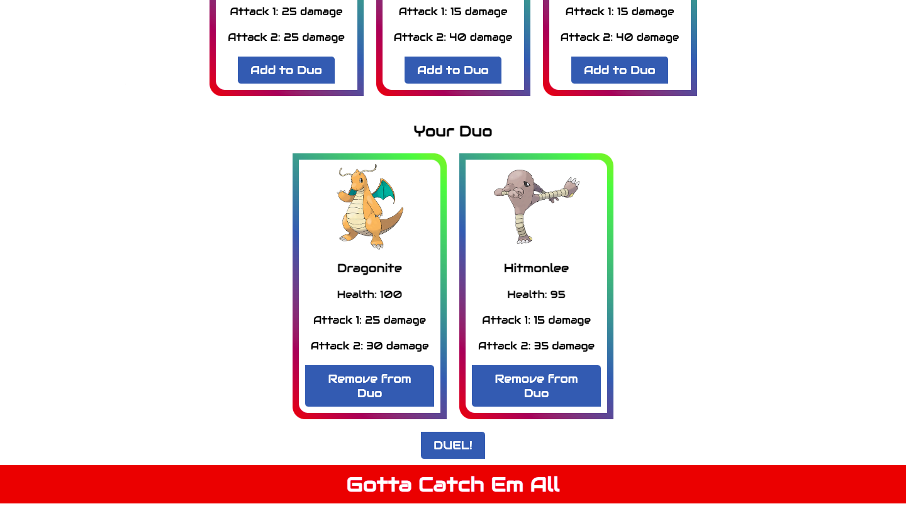
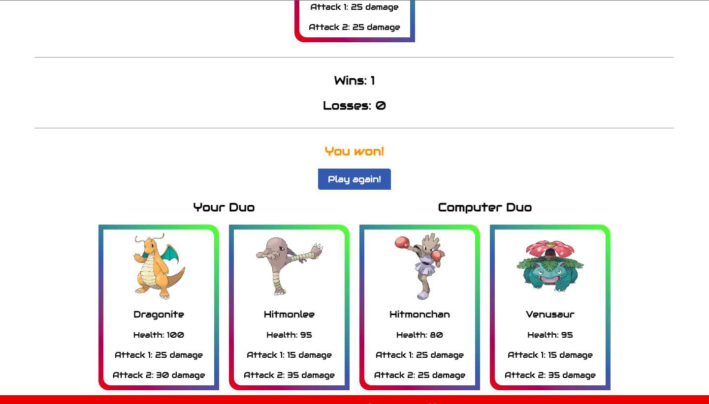

*"Pokemon Stadium"*
===========
Learn more about the developer: 

LinkedIn: https://www.linkedin.com/in/nhathoangdev/

Portfolio: https://nhoang1122.github.io/

Project Deployed On: https://pokemon-card-game-1.herokuapp.com/

*"Pokemon Stadium"* is a Full-Stack Card Game Application based off Pokemon. Users are able to See All the Pokemon and display their Health and Attack Data. User can then select a Team of Two Pokemon to Battle the computer! 

#### Technologies
HTML5, CSS, JavaScript, NodeJS

#### Version 2.0

###### Search Bar
In the future, I'd like to add a search bar so users can easily research Pokemon Info such as Moves, Stats, and Evolutions. 